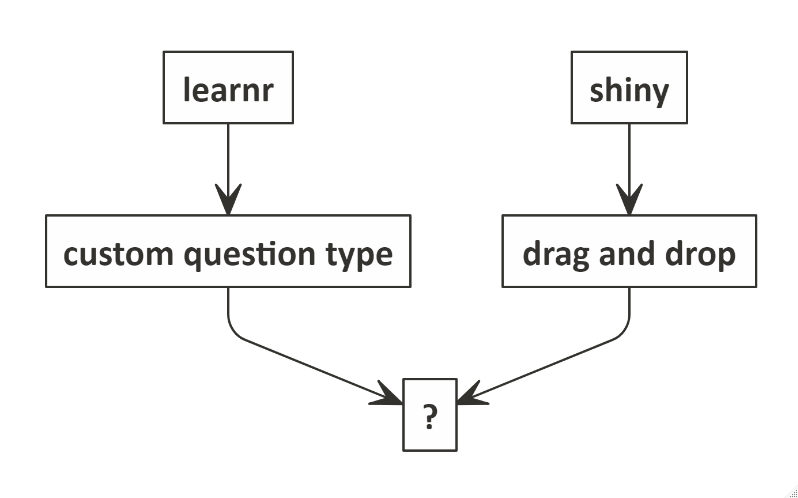
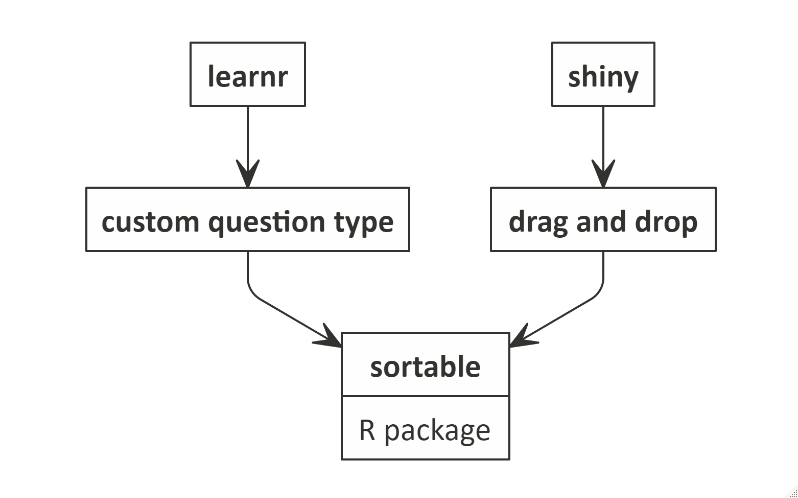
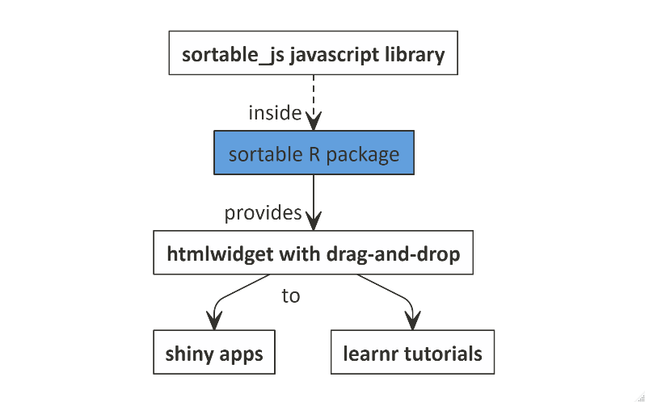
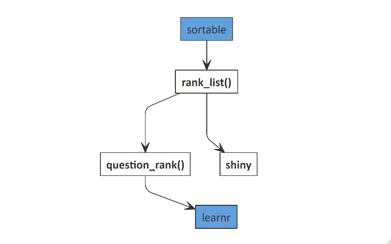
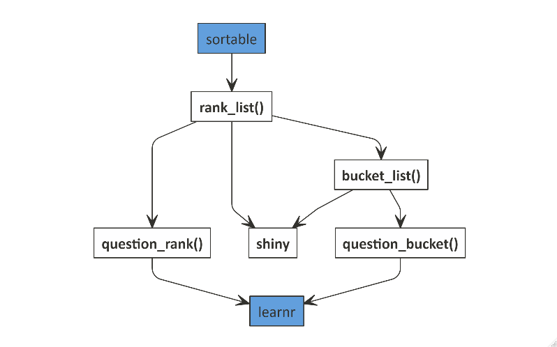

```{r setup, include=FALSE}
options(htmltools.dir.version = FALSE)

rmarkdown::output_metadata$set(
  rsc_output_files = c(
    list.files("images", pattern = "*_wide.jpg", recursive = TRUE, full.names = TRUE),
    list.files("images/nomnoml", pattern = "*.png", recursive = TRUE, full.names = TRUE)
  )
)
```

```{r xaringan-themer, include=FALSE, warning=FALSE}
library(xaringanthemer)
library(showtext)
style_duo_accent(
  primary_color = "#3771c8",
  secondary_color = "#629fdd",
  inverse_header_color = "#FFFFFF",
  title_slide_background_image = "images/flickr/ice-crystals-wide.jpg",
  title_slide_text_color = "black"
)
```

class: ribbon, ribbon-bottom

background-image: url("images/flickr/towers_of_hanoi_wide.jpg")
background-size: contain

# Motivation

---

## Formative assessment

I teach R administration once per month

I want my students to have **continuous learning and feedback**

* They must be able to find the answer themselves

Formative assessment gives **immediate feedback**

One way of doing this is to ask **ranking questions**

* For example, what is the correct sequence of installing a product?


---
class: ribbon, ribbon-bottom

background-image: url("images/flickr/towers_of_hanoi_wide.jpg")
background-size: contain

## I want to ask ranking questions using `learnr`

---

class: ribbon, ribbon-bottom

background-image: url("images/flickr/running_by_wide.jpg")
background-size: contain

## I want to drag...


---

class: ribbon, ribbon-bottom

background-image: url("images/flickr/resting_wide.jpg")
background-size: contain

## ... and drop

---

class: ribbon, ribbon-bottom

background-image: url("images/flickr/ice_sculpture_wide.jpg")

background-size: contain
## ... and create custom question types 

---

## Simple, right?

.center[

]

---


## Introducing `sortable`

.center[

]


---

class: ribbon, ribbon-bottom

background-image: url("images/flickr/towers_of_hanoi_wide.jpg")
background-size: contain


# Show me a demo!

---


## Demo tutorial


<div class='wrap-tutorial'>
<iframe 
src="https://andrie-de-vries.shinyapps.io/sortable_tutorial_question_rank/#section-creating-a-ranking-question"
></iframe>
</div>

---

## Show me the code

```{r eval=FALSE}
# Define the answer options
library(sortable) #<<

insects <- c(
    "ant",
    "bumble bee",
    "cricket",
    "dragonfly"
  )

# Initialize the question
question_rank( #<<
  "Sort these insects in alpabetical order:",
  answer(insects, correct = TRUE),
  answer(rev(insects), correct = FALSE, message = "Other direction!"),
  allow_retry = TRUE
) #<<
```

---

class: ribbon, ribbon-bottom

background-image: url("images/flickr/towers_of_hanoi_wide.jpg")
background-size: contain

# How to use `sortable` in a shiny app?

---

## Demo app


<div class='wrap-tutorial'><iframe 
src="https://andrie-de-vries.shinyapps.io/sortable_rank_list_app/"
></iframe></div>

---

## Show me the code

First define some labels to appear in a list:

```{r eval=FALSE}
labels <- list(
  "one",
  "two",
  "three",
  "four",
  "five"
)
```

---

## Using `rank_list()`

```{r eval=FALSE}
library(shiny)
library(sortable) #<<

ui <- fluidPage(
  tags$b("Exercise"),
  rank_list( #<<
    text = "Drag the items in any desired order", #<<
    labels = labels, #<<
    input_id = "rank_list_basic" #<<
  ), #<<
  tags$b("Result"),
  verbatimTextOutput("results_basic")
)

server <- function(input, output) {
  output$results_basic <- renderPrint({
    ## This matches the input_id of the rank list
    input$rank_list_basic
  })
}
```

---

## Matching the `input_id` and output

```{r eval=FALSE}
library(shiny)
library(sortable)

ui <- fluidPage(
  tags$b("Exercise"),
  rank_list(
    text = "Drag the items in any desired order",
    labels = labels,
    input_id = "rank_list_basic" #<<
  ),
  tags$b("Result"),
  verbatimTextOutput("results_basic")
)

server <- function(input, output) {
  output$results_basic <- renderPrint({
    ## This matches the input_id of the rank list
    input$rank_list_basic #<<
  })
}
```


---

## Summary of using `rank_list()` in a `shiny` app

Steps: 

* Use `rank_list()`
* Define the `input_id` in the UI
* Use the matching `output` in the server


```{r eval=FALSE}
ui <- fluidPage(

  rank_list( #<<
    text = "Drag the items in any desired order",
    labels = labels,
    input_id = "rank_list_basic" #<<
  ),
  verbatimTextOutput("results_basic")
)

server <- function(input, output) {
  output$results_basic <- renderPrint({
    ## This matches the input_id of the rank list
    input$rank_list_basic #<<
  })
}
```


---

class: ribbon, ribbon-bottom

background-image: url("images/flickr/towers_of_hanoi_wide.jpg")
background-size: contain

# Please give me a mental model!

---

## Concept map

.center[

]

---


## Sortable functions

.center[

]


---

## Sortable functions

.center[

]


---

## Bucket list


<div class='wrap-tutorial'><iframe 
src="https://andrie-de-vries.shinyapps.io/sortable_bucket_list_app/"
></iframe></div>


---


class: ribbon, ribbon-bottom

background-image: url("images/flickr/towers_of_hanoi_wide.jpg")
background-size: contain

# What else is there to know?


---

## Sortable is a framework

Sortable is essentially a fairly light-weight wrapper around `sortable.js`

* In principle you can make anything drag-and-drop

* The `sortable` R package exposes

  - A low-level interface to `sortable.js`
  
  - Example implementation of functions to use in a shiny app and learnr tutorials
  

---

## Many other options to build your own apps

* Built-in support for `sortable.js` plugins

  - Multi-drag
  - Swap
  
* Options to control many other aspects
  
  - Shared lists
  - Cloning
  - Put (control whether a list can accept elements)
  - Pull (control if you can drag from a list)
  
* Wrappers to inject your own JavaScript functions


<hr>

See also: https://sortablejs.github.io/Sortable/


---

class: ribbon, ribbon-bottom

background-image: url("images/flickr/adelie_penguins_wide.jpg")
background-size: contain

# Show me some penguins!

---


background-image: url("images/flickr/adelie_penguins_wide.jpg")
background-size: contain

## Penguins

<div class='wrap-app'>
<iframe 
src="https://andrie-de-vries.shinyapps.io/penguins-and-sortable/"
></iframe>
</div>

---


class: ribbon, ribbon-bottom

background-image: url("images/flickr/adelie_penguins_wide.jpg")
background-size: contain

# Conclusion

---

## Conclusion

Use `sortable` to:

* Add **rank and bucket lists** to `shiny` apps

* Add **ranking and bucketing questions**  to `learnr tutorials

* Create your own **complex drag-and-drop** in `shiny` apps

---

class: ribbon

background-image: url("images/flickr/towers_of_hanoi_wide.jpg")
background-size: contain


## Package: <small>github.com/rstudio/sortable</small>

## Slides: <small>https://colorado.rstudio.com/rsc/intro-to-sortable/</small>

## Source: <small>https://github.com/andrie/intro_to_sortable</small>

## @RevoAndrie


